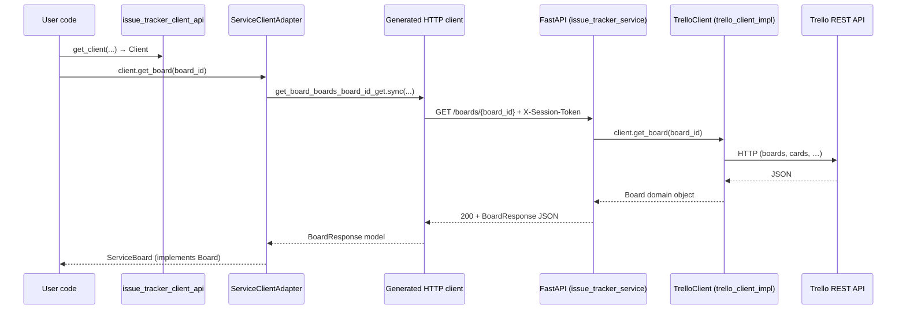

# Issue Tracker — Service-Based Design (Homework 2)

This document describes how the **Homework 1 library-based issue tracker** was extended with a **networked service**, an **OpenAPI-generated HTTP client**, and an **adapter** so application code can stay written against the same `Client` interface whether it uses the in-process Trello implementation or the remote service.

> **Mapping to the assignment:** The write-up uses “Gmail” as an example; this project’s “original implementation” is the **`trello_client_impl`** library, which talks to the **Trello REST API**. The same three bridges apply: FastAPI service → generated client → adapter → existing `Client` contract.

---

## Architecture Overview

### Components

| Component | Package / location | Role |
|-----------|-------------------|------|
| **Abstract contract (HW1)** | `issue_tracker_client_api` | Defines the `Client` ABC and domain types (`Board`, `Issue`, `List`, `Member`) and a factory `get_client()`. |
| **Original library implementation** | `trello_client_impl` | `TrelloClient` implements `Client` by calling Trello directly (HTTP from the same process). |
| **FastAPI service** | `issue_tracker_service` | HTTP API that authenticates the caller, then delegates to `TrelloClient` for each request. Wraps existing logic; it does not reimplement Trello rules in a second place. |
| **OpenAPI spec** | Produced by FastAPI / exported for codegen | Describes REST paths, JSON bodies, and headers (e.g. `X-Session-Token`). |
| **Auto-generated HTTP client** | `issue_tracker_service_client` | Typed client generated from the OpenAPI spec (e.g. via `openapi-python-client`). Knows how to call `/boards`, `/issues`, etc., but speaks in **HTTP + generated models**, not the domain `Client` ABC. |
| **Adapter** | `issue_tracker_adapter` | `ServiceClientAdapter` implements `Client` by calling the generated client, mapping JSON/models to `ServiceBoard`, `ServiceIssue`, etc., and attaching the session token to each request. |
| **Registration** | `issue_tracker_adapter.register()` | Replaces `issue_tracker_client_api.get_client` so consumers that already call `get_client(...)` receive a `ServiceClientAdapter` when the adapter is registered. |

**Interaction summary:** User code depends only on `issue_tracker_client_api`. Either `trello_client_impl` is imported (direct Trello) or `issue_tracker_adapter.register()` is called (remote service). The FastAPI process holds Trello credentials and OAuth session state; clients only need the service URL and a session token from `/auth/callback`.

### Request Flow

One complete read request (example: **get a board by id**) when using the service path:



**Path in words:**  
`user code` → **`ServiceClientAdapter`** → **generated sync client** → **FastAPI route** → **`TrelloClient`** → **Trello API** → responses return along the same chain, with JSON deserialized to generated models and then to `Service*` domain objects.

### Sample API response

Example **`GET /boards/{board_id}`** success body (fields match `BoardResponse` in `main.py`):

```json
{
  "id": "507f1f77bcf86cd799439011",
  "name": "Sprint Board",
  "url": null
}
```

Example **`GET /health`** (no auth):

```json
{
  "status": "ok"
}
```

Example mutation response **`POST /boards/{board_id}/members`**:

```json
{
  "success": true
}
```

*(Real values depend on Trello data; shapes follow the Pydantic models in the service.)*

---

## API Design

### Endpoints

All API routes below are served by **`issue_tracker_service`** unless noted. Mutating routes expect JSON bodies where indicated. Authenticated routes require header **`X-Session-Token: &lt;session_token&gt;`** (from OAuth callback), except `/health` and `/auth/*`.

| Method | Path | Request body / query | Response |
|--------|------|----------------------|----------|
| GET | `/` | — | Redirect to `/docs` |
| GET | `/health` | — | `{"status": "ok"}` |
| GET | `/auth/login` | — | Redirect to Trello OAuth |
| GET | `/auth/callback` | OAuth query params | Redirect / JSON with `session_token` (see auth module) |
| GET | `/boards` | — | `[BoardResponse, ...]` |
| GET | `/boards/{board_id}` | — | `BoardResponse` |
| POST | `/boards` | `{"name": "..."}` | `BoardResponse` |
| POST | `/boards/{board_id}/members` | `{"member_id": "..."}` | `{"success": bool}` |
| GET | `/boards/{board_id}/lists` | — | `[ListResponse, ...]` |
| GET | `/lists/{list_id}` | — | `ListResponse` |
| POST | `/lists` | `{"board_id", "name"}` | `ListResponse` |
| PUT | `/lists/{list_id}` | `{"name": "..."}` | `ListResponse` |
| DELETE | `/lists/{list_id}` | — | `{"success": bool}` |
| GET | `/lists/{list_id}/issues` | `max_issues` query (1–500, default 100) | `[IssueResponse, ...]` |
| GET | `/issues/{issue_id}` | — | `IssueResponse` |
| POST | `/issues` | `{"title", "list_id", "description"?}` | `IssueResponse` |
| PUT | `/issues/{issue_id}/status` | `{"status": "..."}` | `{"success": bool}` |
| DELETE | `/issues/{issue_id}` | — | `{"success": bool}` |
| GET | `/issues/{issue_id}/members` | — | `[MemberResponse, ...]` |
| POST | `/issues/{issue_id}/assign` | `member_id` as query param | `{"success": bool}` |

OpenAPI details and try-it-out UI: **`GET /docs`** (Swagger UI) when the service is running.

### Error handling

**How Trello / library errors become HTTP responses**

- **FastAPI / Pydantic validation:** Invalid JSON, missing required fields, or wrong types → **`422 Unprocessable Entity`** with validation detail (e.g. missing `name` on `POST /boards`).
- **Missing / bad session:** No or unknown `X-Session-Token` on protected routes → **`401 Unauthorized`** (`"Invalid or missing session token"`).
- **OAuth routes (`/auth/...`):** Explicit `HTTPException` paths (e.g. failed token exchange) → **`500`** or other status with a `detail` string as implemented in `routes/auth.py`.
- **Trello / `TrelloClient` errors:** Route handlers generally **do not wrap** `client.*` calls in `try/except`. Exceptions raised inside `trello_client_impl` (e.g. `ValueError`, `TypeError`, or HTTP-related failures from `requests`) propagate to FastAPI and are turned into a generic **`500 Internal Server Error`** response for unhandled exceptions. There is **no** dedicated mapping from Trello error codes to per-status HTTP responses in the current service layer.
- **Adapter / generated client:** The adapter's `_call_api` helper centralizes HTTP error translation so callers receive standard Python exceptions instead of raw `httpx` or generated-client errors:

  | Generated-client error | Adapter raises | Example scenario |
  |------------------------|----------------|------------------|
  | `httpx.TimeoutException` | **`TimeoutError`** | Service did not respond in time |
  | `httpx.ConnectError` | **`ConnectionError`** | Service is unreachable / DNS failure |
  | `httpx.HTTPError` (other) | **`ConnectionError`** | Generic transport-layer failure |
  | `errors.UnexpectedStatus` | **`RuntimeError`** | Service returned an undocumented HTTP status |
  | `HTTPValidationError` (422 response) | **`ValueError`** | Request body failed Pydantic validation on the service |
  | Successful response with wrong type | **`TypeError`** | `_ensure_*` helpers detect `None` or unexpected model |

  This centralizes error handling in the adapter rather than exposing raw transport exceptions to the caller.

---

## The Adapter Pattern

### Why it’s needed

The **generated client** is tied to **REST mechanics**: fixed paths, query names, JSON field names, header names, and generated Pydantic-like models. The **HW1 `Client` interface** is **domain-oriented**: methods like `get_board(id)`, iterators returning `Board` / `Issue`, and OAuth methods that make sense for an in-process Trello client.

So the generated client **does not** implement `issue_tracker_client_api.Client` and does not return `TrelloBoard` / `ServiceBoard` directly. Without an adapter, every consumer would break the abstraction and depend on OpenAPI types and HTTP details.

The **adapter** implements `Client` by:

- Calling the correct generated `*.sync(...)` function per method.
- Passing `X-Session-Token` on each request.
- Converting `BoardResponse` / `IssueResponse` / etc. to `ServiceBoard` / `ServiceIssue` / …
- Mapping `{"success": ...}` payloads to `bool` for mutating operations.

OAuth is **not** duplicated in the adapter: `get_authorization_url` / `exchange_request_token` raise `NotImplementedError` with a message to use the service’s `/auth/*` routes instead.

### How it works — library vs service (code shape)

**Library path (same process, Trello directly):**

```python
import trello_client_impl  # registers get_client → TrelloClient
from issue_tracker_client_api import get_client

client = get_client(api_key="...", token="...", ...)
board = client.get_board("board_id")  # TrelloClient
```

**Service path (remote HTTP; same `Client` methods after registration):**

```python
from issue_tracker_adapter import register
import issue_tracker_client_api

register()
from issue_tracker_client_api import get_client

client = get_client(
    base_url="https://ospsd-team7-issue-tracker.onrender.com",
    session_token="<token from /auth/callback>",
)
board = client.get_board("board_id")  # ServiceClientAdapter → HTTP → FastAPI → TrelloClient
```

Internally, the adapter’s `get_board` delegates to the generated API and maps the result:

```python
# Simplified from issue_tracker_adapter/client.py
result = get_board_api.sync(
    board_id=board_id,
    client=self._http_client,
    x_session_token=self._session_token,
)
return ServiceBoard.from_response(self._ensure_board(result))
```

---

## Testing Strategy

### What we tested

- **`issue_tracker_client_api`:** ABC contract and factory behavior (e.g. `get_client` wiring).
- **`trello_client_impl`:** Direct Trello client behavior with mocks where appropriate.
- **`issue_tracker_service`:** FastAPI routes with **`TrelloClient` mocked** via dependency override — auth (`401` / `422`), validation, and successful JSON shapes for boards, lists, issues, members.
- **`issue_tracker_adapter`:** `ServiceClientAdapter` and `get_client_impl` / `register` with **`unittest.mock.patch`** on generated API modules so no real HTTP runs in unit tests.
- **`tests/integration`:** Interface compliance and adapter wiring against **mocked** HTTP or client behavior (see integration `conftest`).
- **`tests/e2e`:** Optional **real Trello API** tests when `TRELLO_*` env vars are set; skipped otherwise.

### Test types

| Type | Where | Purpose |
|------|--------|---------|
| **Unit** | Per-component `tests/` under each package | Isolated logic, fast feedback, mocked I/O. |
| **Integration** | `tests/integration/` | Cross-package behavior (e.g. adapter + types) without requiring deployment. |
| **E2E** | `tests/e2e/` | Real Trello credentials; validates end-to-end behavior against the live API (marked `e2e`, skipped if not configured). |

### Mocking strategy

- **Service tests:** Mock **`TrelloClient`** (or override `get_authenticated_client`) so tests do not call Trello or require OAuth. This keeps CI deterministic.
- **Adapter tests:** Mock **`issue_tracker_adapter.client.*_api.sync`** (generated entry points) to return `BoardResponse`-like objects or edge cases (`None`, wrong types) without opening sockets.
- **Real implementations:** E2E tests use a real **`TrelloClient`** (and optionally exercise flows that hit the network) when credentials are provided.

### Interface compliance

1. **Static / structural:** `ServiceClientAdapter` subclasses `issue_tracker_client_api.Client`; tests assert `isinstance(adapter, Client)`.
2. **Behavioral:** Unit tests exercise each `Client` method on the adapter with mocked HTTP layers and assert return types (`ServiceBoard`, iterators of `ServiceIssue`, `bool` for mutations, etc.) and that invalid responses raise expected errors (e.g. `TypeError` from `_ensure_*`).
3. **Factory:** Tests cover `get_client_impl` (required `base_url` / `session_token`) and `register()` replacing `get_client`.
4. **Parity with HW1:** Integration tests ensure both Trello and adapter paths honor the same interface surface (method presence, callability) where applicable.

Together, this checks that the adapter is not only a subclass but behaves as a drop-in **`Client`** for the operations covered by tests.

---

## References

- Additional UML and dependency notes: [`docs/architecture.md`](docs/architecture.md)
- Service entrypoint: `components/issue_tracker_service/src/issue_tracker_service/main.py`
- Adapter: `components/issue_tracker_adapter/src/issue_tracker_adapter/client.py`
