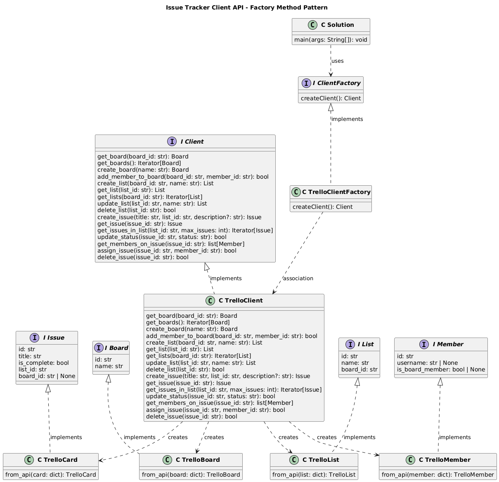

# Issue Tracker Client API — System Design Architecture

This document describes the system design architecture for the issue tracker client implementation, including interface choices, design patterns, and relationship guidelines.

---

## 1. Which Classes Should Have Interfaces?

**Best practice:** Define interfaces (or abstract base classes in Python) for any abstraction that has multiple implementations or represents a contract that consumers depend on.

### Recommended Interfaces (Abstract Base Classes)

| Interface | Purpose | Concrete Implementation |
|-----------|---------|-------------------------|
| **Client** | Contract for issue tracker operations (get issues, boards, members, update status, assign) | `TrelloClient` |
| **Issue** | Contract for issue representation (`id`, `title`, `is_complete`, `list_id`, `board_id`) | `TrelloCard` |
| **Board** | Contract for board representation (`id`, `name`) | `TrelloBoard` |
| **List** | Contract for list representation (`id`, `name`, `board_id`) | `TrelloList` |
| **Member** | Contract for member representation (`id`, `username`, `is_board_member`) | `TrelloMember` |
| **ClientFactory** | Contract for creating Client instances | `get_client` factory function (Trello) |

### Why These Interfaces?

- **Client**: The main operations interface. Consumers depend on `Client`, not `TrelloClient`, keeping the implementation decoupled and testable.
- **Issue, Board, List, Member**: Domain objects returned by `Client`. Interfaces let Trello API responses (Card, Board, List, Member) map to a common contract.
- **ClientFactory**: Decouples client creation from consumers via the `get_client()` factory function and registration.

### Classes That Do NOT Need Interfaces

- **TrelloClient, TrelloCard, TrelloBoard, TrelloList, TrelloMember**: These are concrete implementations; they implement interfaces but are not extended by other classes.
- **Helper/utility classes** (e.g., `_load_token`): Internal implementation details.

---

## 2. Singleton vs Factory — Best Practices

**Recommendation: Use the Factory pattern** (as in the reference UML).

### Factory Pattern (Preferred)

| Benefit | Explanation |
|---------|-------------|
| **Decoupling** | Consumers depend on `Client` interface, not concrete `TrelloClient`. |
| **Testability** | Easy to inject mock clients in tests. |
| **Flexibility** | Different configurations (API keys, tokens) per instance. |

### When NOT to Use Singleton

| Concern | Why |
|---------|-----|
| **Single global instance** | Issue tracker clients often need different credentials or boards per context (e.g., dev vs prod). |
| **Testing** | Singletons make unit testing harder (global state, harder to mock). |
| **Multi-tenancy** | If the app serves multiple users/workspaces, one singleton is insufficient. |

### When Singleton Might Be Acceptable

- A **configuration loader** or **connection pool** where exactly one instance is desired.
- Not for the main `Client` or `ClientFactory` — keep those as factory-created instances.

**Conclusion:** The current design (factory function `get_client()` with registration) aligns with best practices. A formal `ClientFactory` interface with `createClient()` would make the pattern even more explicit (see UML).

---

## 3. Is-a vs Has-a Relationships

Both are used appropriately in the architecture.

### Is-a (Generalization / Realization)

| Relationship | Meaning |
|--------------|---------|
| `TrelloClient` **is-a** `Client` | Implements the `Client` interface. |
| `TrelloCard` **is-a** `Issue` | Implements the `Issue` interface. |
| `TrelloBoard` **is-a** `Board` | Implements the `Board` interface. |
| `TrelloMember` **is-a** `Member` | Implements the `Member` interface. |

**Use is-a when:** A class provides a specific implementation of a contract (interface/ABC). Enables polymorphism.

### Has-a (Association / Composition / Dependency)

| Relationship | Meaning |
|--------------|---------|
| **Consumer** *uses* `get_client()` | Consumer depends on the factory to obtain a `Client`. |
| `get_client()` *creates* `TrelloClient` | Factory function instantiates the Trello client. |
| `TrelloClient` *returns* `Issue`, `Board`, `Member` | Client produces domain objects; it "has" the capability to create them. |
| `TrelloClient` *uses* `requests` (HTTP) | Client depends on HTTP library for API calls. |

**Use has-a when:** One object uses, contains, or creates another. Represents composition, association, or dependency.

### Summary

- **Is-a**: For polymorphism and interface implementation (dashed arrows to interfaces).
- **Has-a**: For creation responsibility, dependencies, and usage (solid arrows, "uses" stereotype).

---

## 4. Architecture Overview (Trello)

```
┌─────────────────┐     uses      ┌──────────────────┐
│   Consumer      │ ────────────► │  get_client()   │
│   (Solution)    │               │  (Factory)      │
└─────────────────┘               └────────┬─────────┘
                                           │
                                           ▼
                                ┌────────────────────┐
                                │  TrelloClient      │
                                │  (implements       │
                                │   Client)          │
                                └────────┬───────────┘
                                         │ creates
                    ┌────────────────────┼────────────────────┐
                    ▼                    ▼                    ▼
           ┌──────────────┐    ┌──────────────┐    ┌──────────────┐
           │ TrelloCard   │    │ TrelloBoard  │    │ TrelloMember │
           │ (Issue)      │    │ (Board)      │    │ (Member)     │
           └──────────────┘    └──────────────┘    └──────────────┘
```

### UML Class Diagram



The diagram is available as `docs/uml.png`. The source is in `docs/architecture.puml` (PlantUML) — you can render it with [PlantUML](https://www.plantuml.com/plantuml/uml/) or the `plantuml` CLI.
